## Ideal Vacation Spots

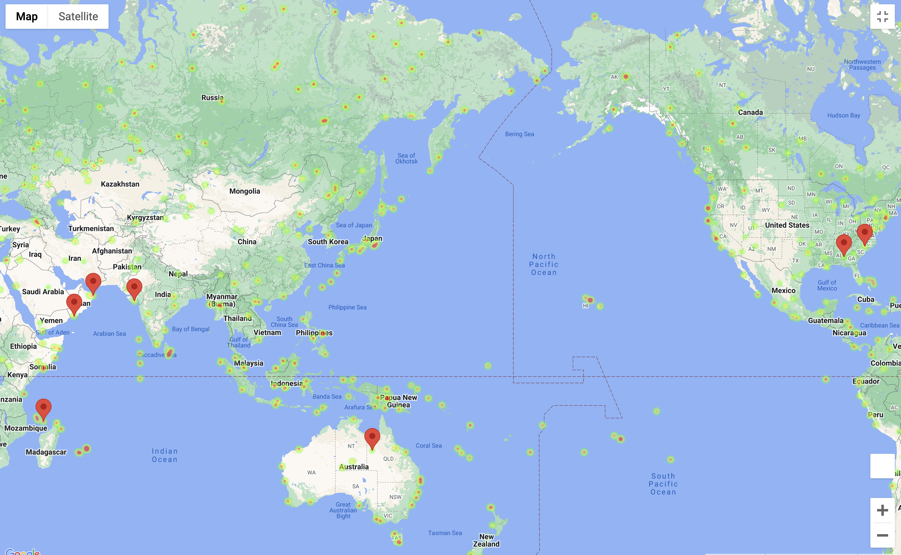

Map Visualization of Ideal Vacation Spots using APIs

### Dataset:

 [Weather API](https://openweathermap.org/api),  [Google Maps API](https://mapsplatform.google.com/)

## Objective #1: Weather 

### Step 1 - Generate Cities List 

* Create a list of cities from a random set of latitudes and longitudes using citipy

### Step 2 - Perform API Calls

* Perform a weather check on each city using a series of successive API calls
    * Include a print log of each city as it'sbeing processed (with the city number and city name)

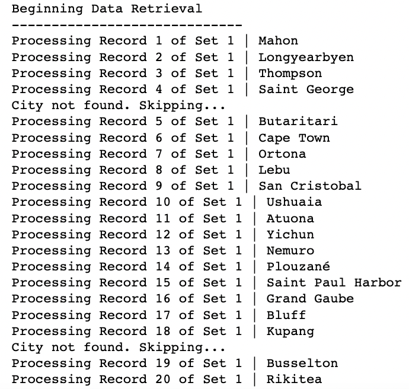

### Step 3 - Convert Raw Data to DataFrame

*  Export the city data into a .csv
*  Display the DataFrame 

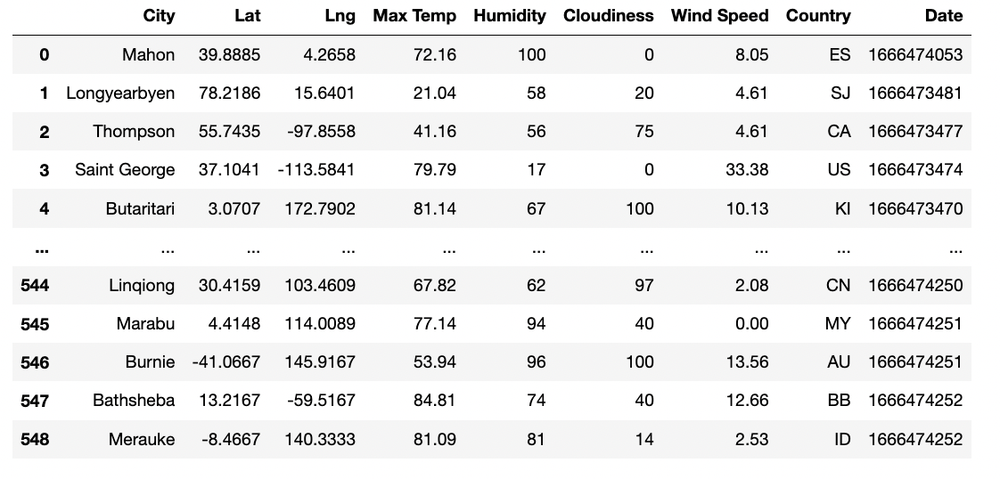

### Step 4 - Plot the Data 

* This scatterplot shows the relationship between the cities' latitude and maximum temperature

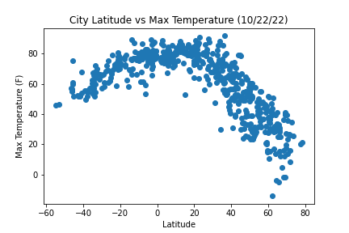

* This scatterplot shows the relationship between the cities' latitude and humidity

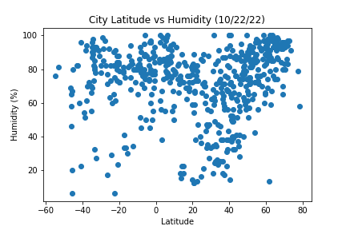

* This scatterplot shows the relationship between the cities' latitude and cloudiness

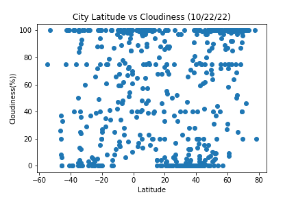

* This scatterplot shows the relationship between the cities' latitude and wind speed

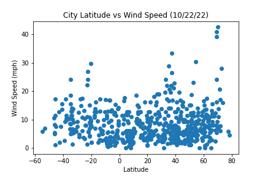

### Step 5 - Linear Regressions 

* This linear regression shows a strong negative correlation between the cities' latitude and maximum temperature in the northern hemisphere
    * As the cities' latitude increases, the maximum temperature decreases

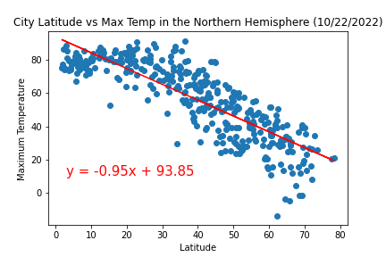

* This linear regression shows a strong positive correlation between the cities' latitude and maximum temperature in the southern hemisphere
    * As the cities' latitude increases, the maximum temperature increases
    
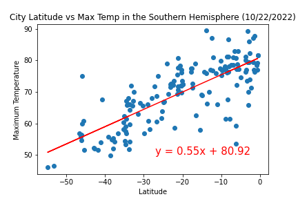

* This linear regression shows a weak positive correlation between the cities' latitude and humidity in the northern hemisphere
    * As the cities' latitude increases, the humidity also increases slightly
    
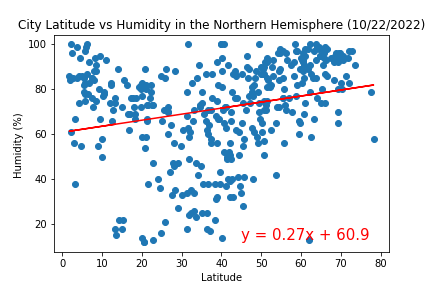

* This linear regression shows a weak positive correlation between the cities' latitude and humidity in the southern hemisphere
    * As the cities' latitude increases, the humidity also increases slightly
    
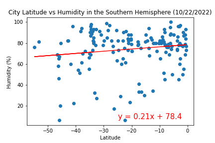

* This linear regression shows a weak positive correlation between the cities' latitude and cloudiness in the northern hemisphere
    * As the cities' latitude increases, the cloudiness also increases slightly
    
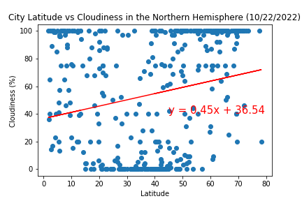

* This linear regression shows a weak positive correlation between the cities' latitude and cloudiness in the southern hemisphere
    * As the cities' latitude increases, the cloudiness also increases slightly
    
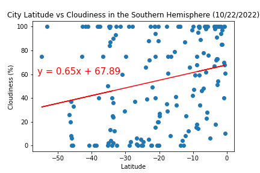

* This linear regression shows a very weak positive correlation between the cities' latitude and wind speed in the northern hemisphere
    * As the cities' latitude increases, the wind speed also increases slightly
    
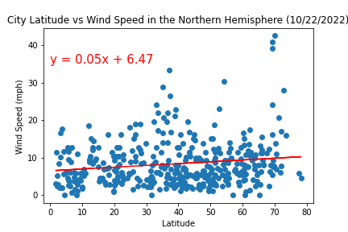

* This linear regression shows a weak negative correlation between the cities' latitude and wind speed in the southern hemisphere
    * As the cities' latitude increases, the wind speed decreases slightly
    
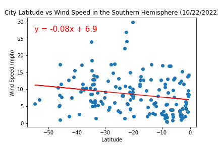

---------------------------------------------------

## Objective #2: Vacation

### Step 1 - Store Part I results into DataFrame

* Load the csv exported in Part I:Weather into a DataFrame

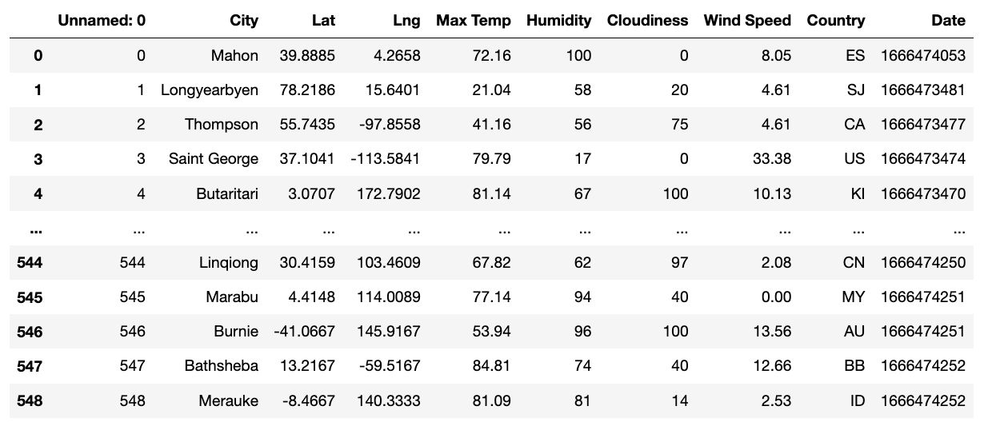

### Step 2 - Humidity Heatmap

* Configure gmaps
* Use the Lat and Lng as locations and Humidity as the weight
* Add Heatmap layer to map

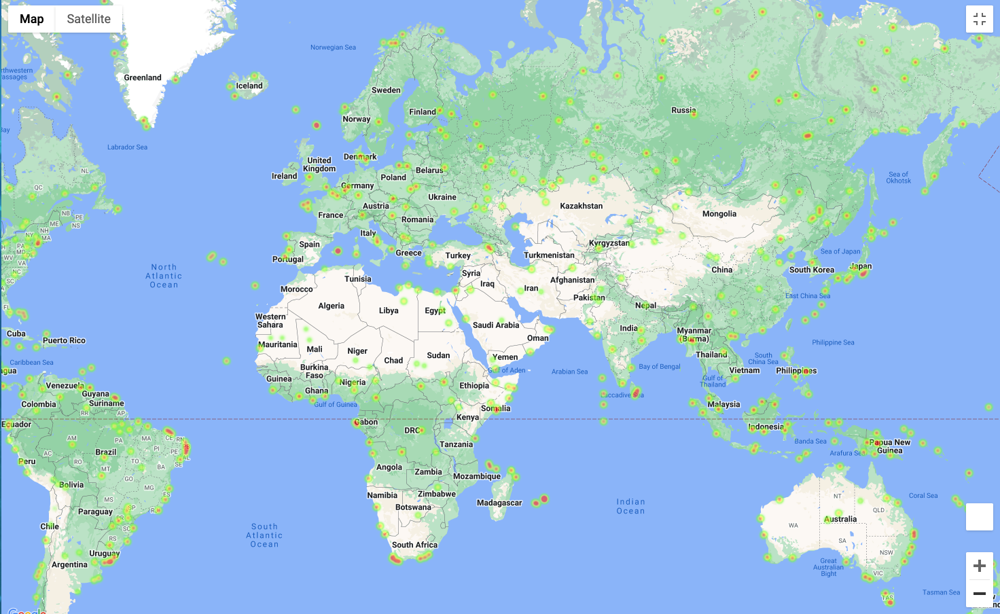

### Step 3 - Create New DataFrame Fitting Weather Criteria

*  Narrow down the cities to fit weather conditions
    * A max temperature lower than 80 degrees but higher than 70
    * Wind speed less than 10 mph
    * Zero cloudiness
*  Drop any rows will null values

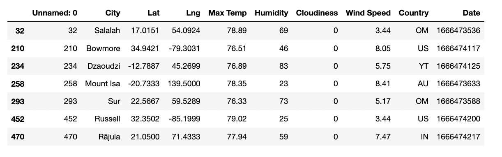

### Step 4 - Create Hotel Map

* Add a "Hotel Name" column to the DataFrame
* Set parameters to search for hotels with 5000 meters
* Hit the Google Places API for each city's coordinates
* Store the first Hotel result into the DataFrame
* Plot markers on top of the heatmap

<b>Contact:</b> bronwynmilne64@gmail.com
